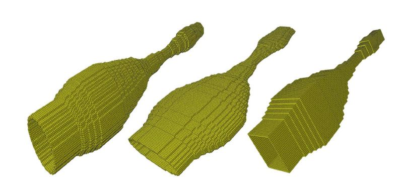

# A three-dimensional (3D) articulatory model
:mailbox: <b>Summary: </b>
 The implemented 3D articulatory model synthesizes speech acoustic for static vocal tract shapes. The model couples a lumped-element vocal fold model [1] *(i.e., two-mass model)* with the 3D vocal tract model to generate synthetic audio output for various vocal tract shapes. During the simulation, the model uses the 1D area functions dataset [2] (i.e., change in vocal tract cross-sectional shape from glottis to lips) to generate the 3D vocal tract contour. The synthesizer then uses the finite-difference time-domain numerical scheme [3][4] to discretize acoustic components (pressure and velocity) on a staggered othrogonal grid and computes the acoustic pressure wave propagation. The implemented model is motivated from Takemoto's 3D vocal tract model [3] and "Aerophones In Flatland" [5] research articles. It also faciliates the transfer function analysis of static vocal tracts having different cross-sectional shapes (i.e., circular, elliptical and square).

:video_game: <b>How to run the simulation:</b>
  - To simulate the articulatory model, use the main.m file in the MATLAB environemnt.
  - For transfer function analysis, use the plotFrequencyPhase.m file.

:books: <b>References:</b>
 [1] <a href ="https://ieeexplore.ieee.org/document/6772490">"Synthesis of voiced sounds from a two-mass model of the vocal cords"</a>  by K. Ishizaka, J. L. Flanagan.
 [2]<a href="https://asa.scitation.org/doi/10.1121/1.2805683">"Comparision of magnetic imaging-based vocal tract area functions obtained from the same speaker in 1994 and 2002"</a> by Brad H. Story
 [3]<a href="https://asa.scitation.org/doi/full/10.1121/1.3502470">"Acoustic Analysis of the vocal tract during vowel production by finite-difference time-domain method"</a> by Hironori Takemoto and Parham Mokhtari.
 [4]<a href = "https://www.jstage.jst.go.jp/article/ast/23/1/23_1_40/_article/-char/ja/">"Visualization of sound propagation and scattering in rooms"</a> by Takatoshi Yokota, Shinichi Sakamoto and Hideki Tachibana
 [5] <a href ="https://dl.acm.org/citation.cfm?id=2767001">"Aerophones in flatland: Interactive Wave Simulation Of Wind Instruments"</a>  by Andrew Allen, Nikunj Raghuvansi.

:golf: <b>Future work: </b>
  - Implementation of bent vocal tract geometries.
  - Direct import of realistic vocal tract geometries from MRI images to the 3D FDTD orthogonal grid.
  - Simulation of realistic vocal tract geometries.
  - Implementation of side branches (e.g., lips, nasal tract, piriform fossa, etc.)
  - Implementation of an accelerated 3D FDTD vocal tract model using modern GPUs [CUDA/OpenCL environment]

:warning: <b>Note:</b>
  For bugs/suggestion/collaboration, please contact: debasishray@ece.ubc.ca
